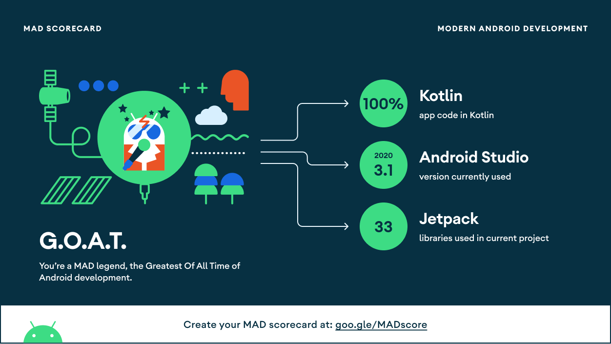
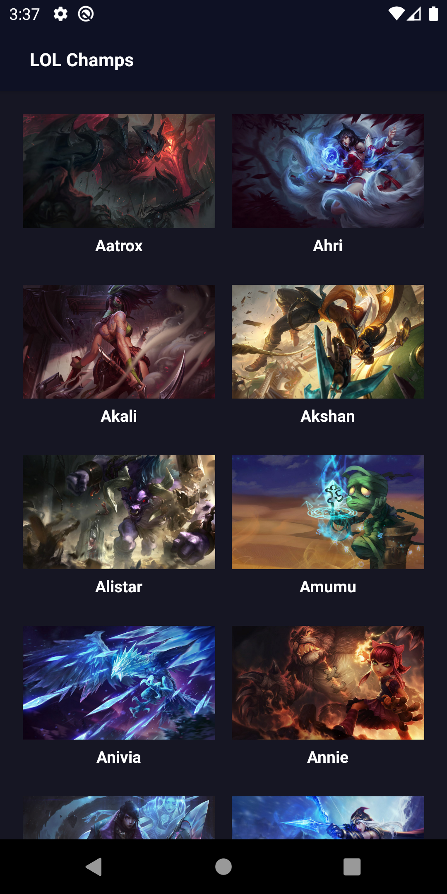
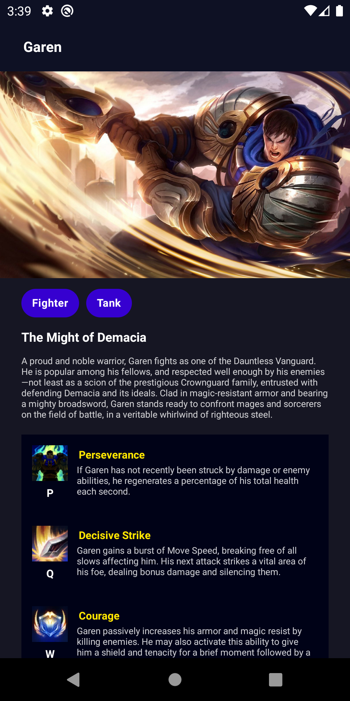
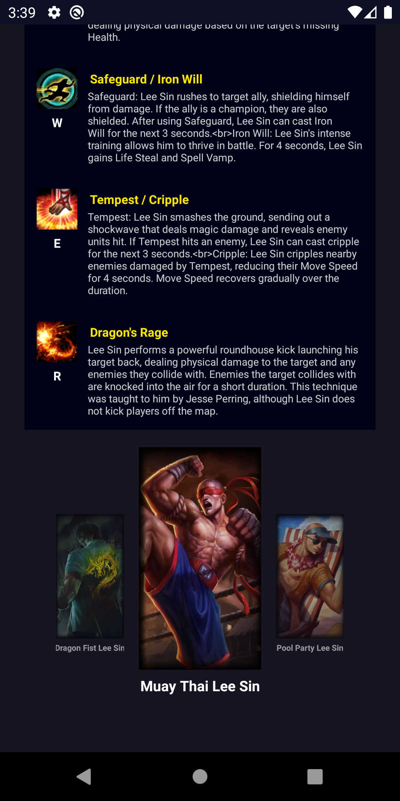

🎉 LOL-Champs
==========
> If this project is useful, please give it a star ⭐

A Android Sample App with champion information of the League of Legends(LOL) using Android Jetpack.

LOL-Champs is a small demo application based on modern Android application tech-stacks and MVVM architecture.
Especially, This project focused on `StateFlow`, not `LiveData`, which is available with AAC DataBinding from the Android Studio Arctic fox version.

Also this project fetch data from the network and cache data into the local database.

🎈 Android Studio IDE setup
----------
For development, the latest version of Android Studio is required. (At least Arctic Fox version)

🗝 Used Libraries
----------


* [Foundation][0] - Components for core system capabilities, Kotlin extensions and support for
  multidex and automated testing.
  * [AppCompat][1] - Degrade gracefully on older versions of Android.
  * [Android KTX][2] - Write more concise, idiomatic Kotlin code.
* [Architecture][10] - A collection of libraries that help you design robust, testable, and
  maintainable apps. Start with classes for managing your UI component lifecycle and handling data
  persistence.
  * [Data Binding][11] - Declaratively bind observable data to UI elements.
  * [Lifecycles][12] - Create a UI that automatically responds to lifecycle events.
  * [Room][16] - Access your app's SQLite database with in-app objects and compile-time checks.
  * [ViewModel][17] - Store UI-related data that isn't destroyed on app rotations. Easily schedule
     asynchronous tasks for optimal execution.
* [UI][30]
  * [Material][31] - Build beautiful, usable products using Material Components for Android
* Third party and miscellaneous libraries
  * [Glide][40] - for image loading
  * [Hilt][41] - for [dependency injection][42]
  * [Retrofit][43] - A type-safe HTTP client for Android and Java.
  * [Kotlin Coroutines][44] - for managing background threads with simplified code and reducing needs for callbacks
  * [CarouselRecyclerView][45] - for creating carousel recyclerview

[0]: https://developer.android.com/jetpack/components
[1]: https://developer.android.com/topic/libraries/support-library/packages#v7-appcompat
[2]: https://developer.android.com/kotlin/ktx
[10]: https://developer.android.com/jetpack/arch/
[11]: https://developer.android.com/topic/libraries/data-binding/
[12]: https://developer.android.com/topic/libraries/architecture/lifecycle
[16]: https://developer.android.com/topic/libraries/architecture/room
[17]: https://developer.android.com/topic/libraries/architecture/viewmodel
[30]: https://developer.android.com/guide/topics/ui
[31]: https://material.io/develop/android
[40]: https://bumptech.github.io/glide/
[41]: https://developer.android.com/training/dependency-injection/hilt-android
[42]: https://developer.android.com/training/dependency-injection
[43]: https://github.com/square/retrofit
[44]: https://kotlinlang.org/docs/reference/coroutines-overview.html
[45]: https://github.com/sparrow007/CarouselRecyclerview

✨ MAD Scorecard
----------



🛕 Architecture
----------
LOL-Champs is based on MVVM design pattern and repository pattern


🎡 Change LOL's Version
----------
LOL-Champs uses the [LOL API](https://developer.riotgames.com/docs/lol) to load data.
If you want update the API version, update the value `LOL_VERSION` in the `build.gradle` file of the app module.

```groovy
buildConfigField "String", "LOL_VERSION", '"11.16.1"' // change this version
```

💡 Non-Goals
----------
The focus of this project is on Android Jetpack and the Android framework. Thus, there are no immediate plans to implement features outside of this scope.

📷 Screenshots
----------
<p align="center">



</p>


☘️License
----------
```xml
Designed and developed by 2021 KimReady (JunBi Kim)

Licensed under the Apache License, Version 2.0 (the "License");
you may not use this file except in compliance with the License.
You may obtain a copy of the License at

   http://www.apache.org/licenses/LICENSE-2.0

Unless required by applicable law or agreed to in writing, software
distributed under the License is distributed on an "AS IS" BASIS,
WITHOUT WARRANTIES OR CONDITIONS OF ANY KIND, either express or implied.
See the License for the specific language governing permissions and
limitations under the License.
```
